# Test Users

You can use the following credentials to test the admin interface:

* Username: `00133121@uca.edu.sv`
* Password: `root1234`

You can use the following credentials to test the client interface:

* Username: `dohernandez@uca.edu.sv`
* Password: `client1234`

# Installing Guide

Install node using nvm
-----------

First you need to install nvm by running the following command:

        wget -qO- https://raw.githubusercontent.com/nvm-sh/nvm/v0.39.1/install.sh | bash

Then you need to export the path to nvm by running the following command:

        export NVM_DIR="$([ -z "${XDG_CONFIG_HOME-}" ] && printf %s "${HOME}/.  nvm" || printf %s "${XDG_CONFIG_HOME}/nvm")"
        [ -s "$NVM_DIR/nvm.sh" ] && \. "$NVM_DIR/nvm.sh" # This loads nvm

Now you need to reload the terminal by running the following command:

        source ~/.bashrc

And finally you can install node lts version by running the following command:

        nvm install --lts

Now you can install yarn using npm by running the following command:

        npm i -g yarn

Finally you can install the required project dependencies by running the following command:

        yarn

# Running the application

Now you can use the application by running the following command:

        yarn dev

# Connecting to client

After running locally the application you can connect to the server using the following URL:

        http://localhost:3000/

# Helpful information

Used Packages
-----------

You can take a look at the used packages in the following link:

-   [axios](https://www.npmjs.com/package/axios)
-   [moment](https://www.npmjs.com/package/moment)
-   [react](https://www.npmjs.com/package/react)
-   [react-dom](https://www.npmjs.com/package/react-dom)
-   [react-image-uploading](https://www.npmjs.com/package/react-image-uploading)
-   [react-moment](https://www.npmjs.com/package/react-moment)
-   [react-responsive](https://www.npmjs.com/package/react-responsive)
-   [react-router-dom](https://www.npmjs.com/package/react-router-dom)
-   [sass](https://www.npmjs.com/package/sass)
-   [sweetalert2](https://www.npmjs.com/package/sweetalert2)

# User's manual

## Landing page
At first, you will see the landing page in which you can explore the categories, recently arrived products and more. 
If you are not logged yet, you only have access to the searching feature in the header.

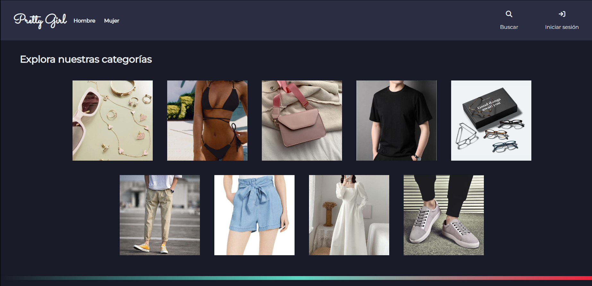
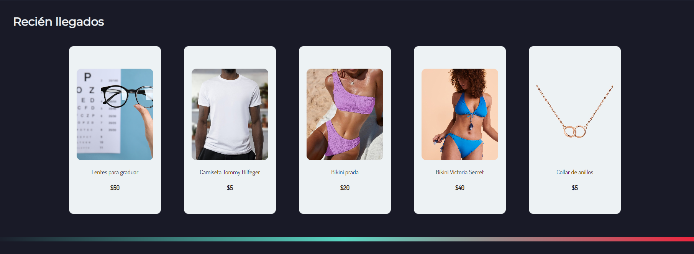

## Searching engine

When clicking the searching button in the header, a searhing engine by filters will be displayed as follows

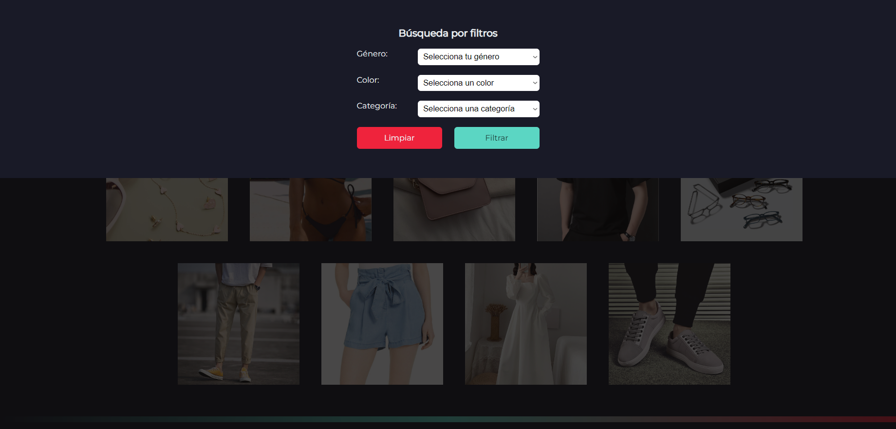

You can obtain two possible results: 

When no item has been found matching the required criteria

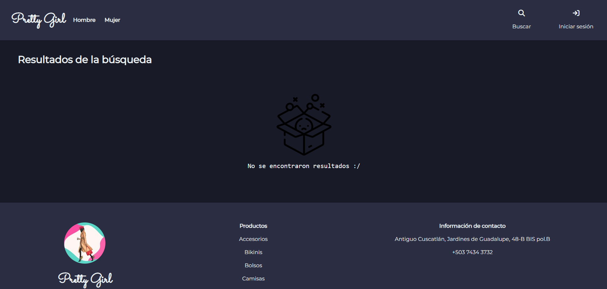

Or a successful search, displaying the items found that match the criteria

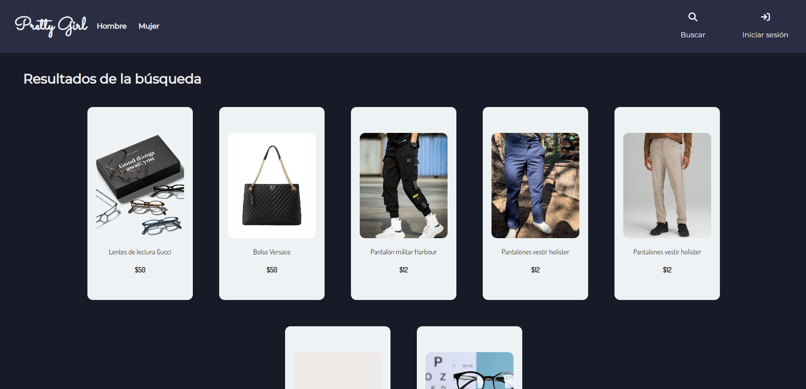

## Login
When clicking the login button in the header, a login form will appear as follows

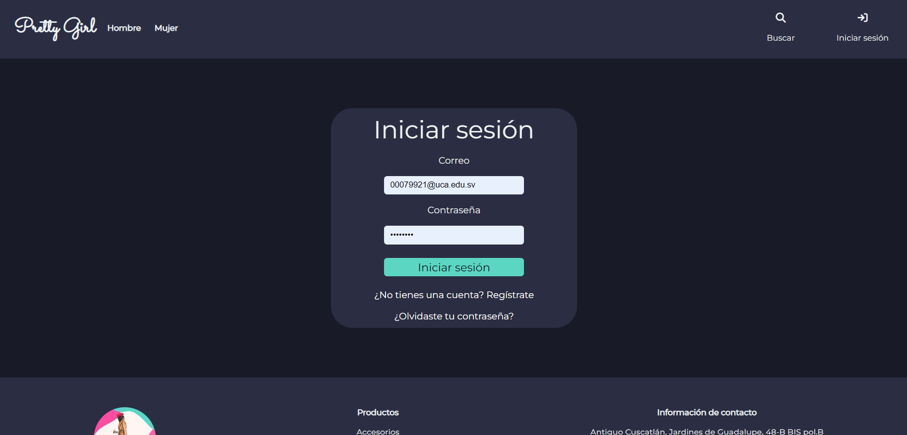

If you already have an account, you can easily write your credentials and you will be redirected to the landing page with new features. On another hand, if you don't have an account already, you can always register by clicking in the link underneath the login form

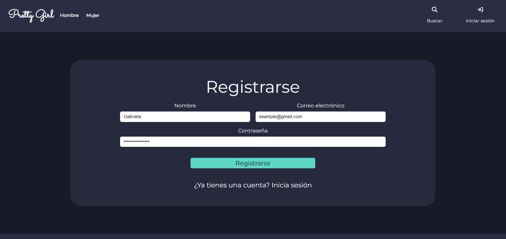

If the login has been succesful, you will see a landing page as follows

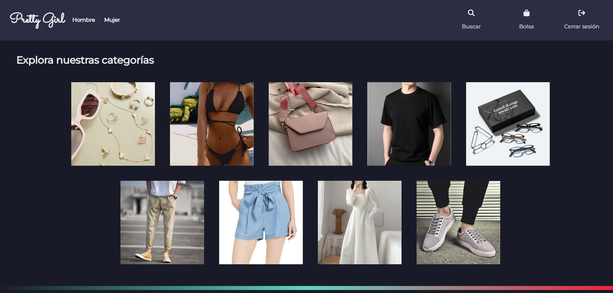

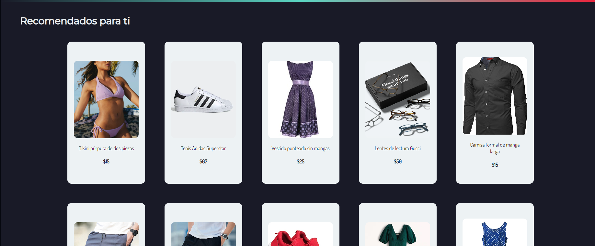

## Product Description
When you click a product card, you will be redirected to a new page in which a brief description of the product will be displayed

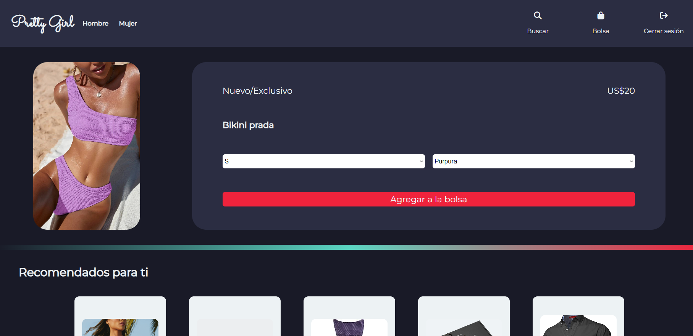

If you wish, you can add each prodduct to your bag and a confirmation message will appear if everything is ok, if not, an error message will be shown.

## Bag

You can access to your bag by the bag button in the header. Here you will see each product you have added to your bag. Additionally, you can modify the quantity of each product you want to book or delete them if you wish.

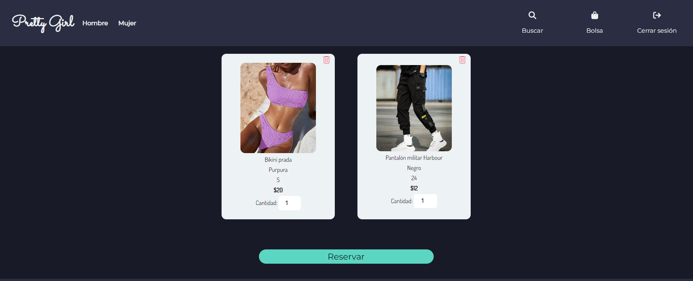

## Booking Process

If you have decided to book the products available in your bag, you will be redirected to the booking process divided by three steps: 

### Client Data
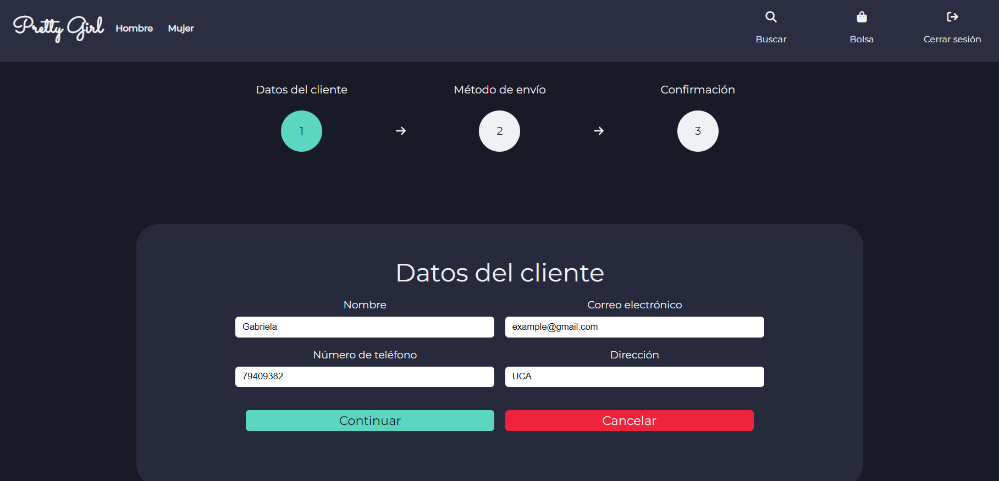
### Booking description and delivery method
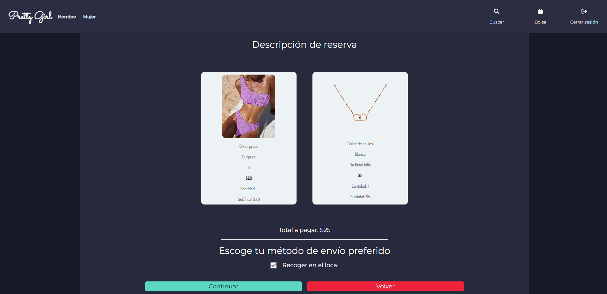
### Confirmation of the booking
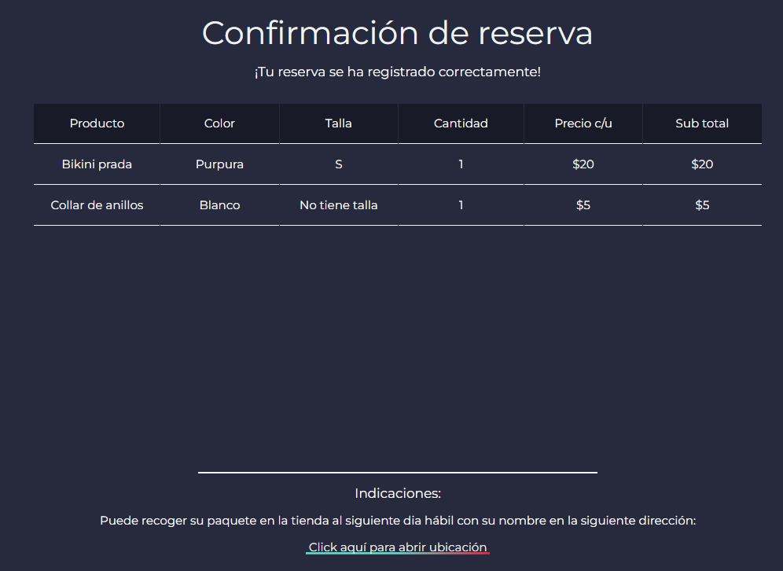

## Admin features

If you are logged as an administrador, new features will be available such as adding or editing products, administrating categories and bookings from the database. In this version, only the Adding Products feature is available.

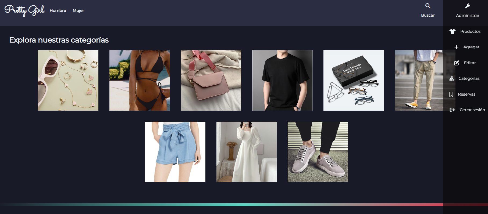

### Add Product 

In this section, an image uploader (for uploading up to one image per product) will be available as well as a form for writing the product's details. 

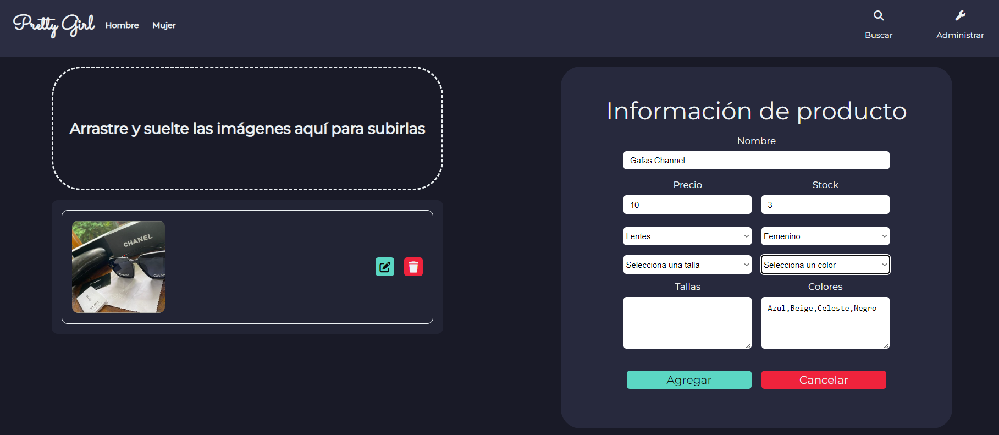

# API Documentation

## Installation

Install node using nvm
-----------

First you need to install nvm by running the following command:

        wget -qO- https://raw.githubusercontent.com/nvm-sh/nvm/v0.39.1/install.sh | bash

Then you need to export the path to nvm by running the following command:

        export NVM_DIR="$([ -z "${XDG_CONFIG_HOME-}" ] && printf %s "${HOME}/.  nvm" || printf %s "${XDG_CONFIG_HOME}/nvm")"
        [ -s "$NVM_DIR/nvm.sh" ] && \. "$NVM_DIR/nvm.sh" # This loads nvm

Now you need to reload the terminal by running the following command:

        source ~/.bashrc

And finally you can install node lts version by running the following command:

        nvm install --lts

After installing node you need to install the required dependencies by running the following command:

        npm i

Setup environment variables
-----------

The first thing you need to do before running the application is to create a `.env` file in the root directory of the project and add the following variables:

        # MONGODB
        MONGODB_CNN = '(Your MongoDB connection string)'
        
        # CLOUDINARY
        CLOUDINARY_CLOUD_NAME = '(Your Cloudinary cloud name)'
        CLOUDINARY_API_KEY = '(Your Cloudinary API key)'
        CLOUDINARY_API_SECRET = '(Your Cloudinary API secret)'
        
        # JSON WEB TOKEN
        JWT_SECRET= '(Your JWT secret)'

# Running the application

Now you can use the API by running the following command:

       npm start

You can also run if you want to use the developer mode:

        npm run dev

# Connecting to server

After running locally the application you can connect to the server using the following URL:

        http://localhost:3000/

Or if you are using the production server you can connect to the server using the following URL:

        https://prettygirl-api-production.up.railway.app/

# Helpful information

Used Packages
-----------

You can take a look at the used packages in the following link:

-   [bcrypt](https://www.npmjs.com/package/bcrypt)
-   [cloudinary](https://www.npmjs.com/package/cloudinary)
-   [cookie-parser](https://www.npmjs.com/package/cookie-parser)
-   [cors](https://www.npmjs.com/package/cors)
-   [debug](https://www.npmjs.com/package/debug)
-   [dotenv](https://www.npmjs.com/package/dotenv)
-   [express](https://www.npmjs.com/package/express)
-   [express-fileupload](https://www.npmjs.com/package/express-fileupload)
-   [express-validator](https://www.npmjs.com/package/express-validator)
-   [hbs](https://www.npmjs.com/package/hbs)
-   [http-errors](https://www.npmjs.com/package/http-errors)
-   [jsonwebtoken](https://www.npmjs.com/package/jsonwebtoken)
-   [jwt-decode](https://www.npmjs.com/package/jwt-decode)
-   [mongoose](https://www.npmjs.com/package/mongoose)
-   [morgan](https://www.npmjs.com/package/morgan)
-   [uuid](https://www.npmjs.com/package/uuid)

## Release Notes

v 1.0.0

## Useful Links

[API Documentation](https://documenter.getpostman.com/view/23770643/2s8YsxvWz1)

[Deployed on Railway](https://prettygirl-api-production.up.railway.app/)
